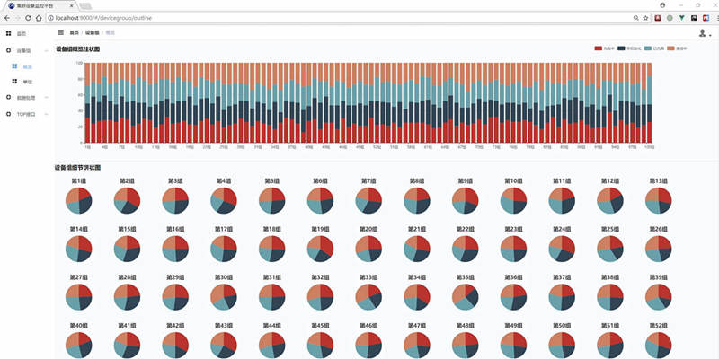

# 基于 Vue.js 2.0 & Element 2.0 的集群设备管理云平台

[](https://github.com/bitkylin/ClusterDeviceControlPlatform-Web/stargazers)
[](https://travis-ci.org/bitkylin/ClusterDeviceControlPlatform-Web)
[](https://david-dm.org/bitkylin/ClusterDeviceControlPlatform-Web)
[](https://github.com/bitkylin/ClusterDeviceControlPlatform-Web/blob/master/LICENSE)


## 项目描述

Java & Vue.js 全栈项目，大规模集群设备管理云平台，由以下几部分组成：**Java 后端服务器、基于 Vue.js 的 Web 前端「SPA」单页应用程序、JavaFX 集群设备模拟客户端、辅助工具组件「Python 脚本、基于 C# & WPF 的可视化配置工具」**，简要介绍如下：

- **Java 后端服务器**：使用 Spring 作为基础框架，使用 Netty 搭建 TCP 服务器与**上万台设备**组成的集群通信，采用自定义帧格式。

- **基于 Vue.js 的 Web 前端「SPA」单页应用程序**：绚丽的现代化 SPA 应用程序，可视化展现服务器内部的各项数据，包括服务器消息队列、通信压力、实时通信信息等。

- **JavaFX 集群设备模拟客户端**：使用基于 JavaFX 的图形界面应用程序模拟上万台设备的行为，并可对服务器进行压力测试。

- **辅助工具组件**：Python 编写的数据库初始化及测试脚本、C# 编写的基于 WPF 的可视化服务器配置工具。

**注意：[本项目为系统的 Web 部分，系统后端部分为单独的项目，点击此处跳转](https://github.com/bitkylin/ClusterDeviceControlPlatform)**

## 运行方法

进入[配套的 Java 后端项目](https://github.com/bitkylin/ClusterDeviceControlPlatform)，根据该项目的说明，即可成功执行工程「clusterdeviceplatform-demo」，而后构建本项目并运行即可，方法如下：

下载并进入该仓库的根目录，在命令行下，安装依赖：

```shell
npm install
```

依赖安装完毕后，执行如下命令进行调试：

```shell
npm run start
```

或执行如下命令进行构建：

```shell
npm run build
```

**当然，以上运行说明并不完善，详细的构建方法及方便的一键构建脚本，可参考如下两篇文章：**

1. [使用 Linux 子系统部署 Node、Gradle 项目的构建工具](https://www.jianshu.com/p/f34d1f2e329c)

2. [Windows 10 用于 Linux 子系统的一键构建、打包脚本「 Node、Gradle 项目」](https://www.jianshu.com/p/6c78f35e228e)

## 项目图示

特别提示：如果无法查看后面的图片，可能需要科学上网。

### 1. 基于 Vue.js 的 Web 前端「SPA」单页应用程序

**Web 登录页面**


**设备组细节概览图示**



**单设备组详细信息显示**


**服务器压力图示**


### 系统架构图示


## 附录

**本项目以[ vueAdmin-template ](https://github.com/PanJiaChen/vueAdmin-template)项目为基础框架开发而成，特别感谢该项目的作者！**

绚丽的现代化 SPA 应用程序，可视化展现服务器内部的各项数据，包括服务器消息队列、通信压力、实时通信信息等。

该应用开发时，设计经验总结可见以下文章：

[基于 Vue.js 2.0 酷炫自适应背景视频登录页面的设计](https://www.jianshu.com/p/8097bb3d9d49)

文章会不时进行更新。

## [License](https://github.com/bitkylin/ClusterDeviceControlPlatform-Web/blob/master/LICENSE)

> MIT License
> 
> Copyright (c) 2018 123lml123
> 
> Permission is hereby granted, free of charge, to any person obtaining a copy
> of this software and associated documentation files (the "Software"), to deal
> in the Software without restriction, including without limitation the rights
> to use, copy, modify, merge, publish, distribute, sublicense, and/or sell
> copies of the Software, and to permit persons to whom the Software is
> furnished to do so, subject to the following conditions:
> 
> The above copyright notice and this permission notice shall be included in all
> copies or substantial portions of the Software.
> 
> THE SOFTWARE IS PROVIDED "AS IS", WITHOUT WARRANTY OF ANY KIND, EXPRESS OR
> IMPLIED, INCLUDING BUT NOT LIMITED TO THE WARRANTIES OF MERCHANTABILITY,
> FITNESS FOR A PARTICULAR PURPOSE AND NONINFRINGEMENT. IN NO EVENT SHALL THE
> AUTHORS OR COPYRIGHT HOLDERS BE LIABLE FOR ANY CLAIM, DAMAGES OR OTHER
> LIABILITY, WHETHER IN AN ACTION OF CONTRACT, TORT OR OTHERWISE, ARISING FROM,
> OUT OF OR IN CONNECTION WITH THE SOFTWARE OR THE USE OR OTHER DEALINGS IN THE
> SOFTWARE.

## 关于我

### 1. 我的主页

名称|域名|原始地址
---|---|---
主页|http://bitky.cc|https://bitkylin.github.io
GitHub|http://github.bitky.cc|https://github.com/bitkylin
简书|http://js.bitky.cc|http://www.jianshu.com/u/bd2e386a6ea8
知乎|http://zhi.bitky.cc|https://www.zhihu.com/people/bitkylin


### 2. 其他

- 兴趣方向: Java, Web, Android, Vue.js, C#, JavaScript, Node.js, Kotlin 等

- Email: bitkylin@163.com
